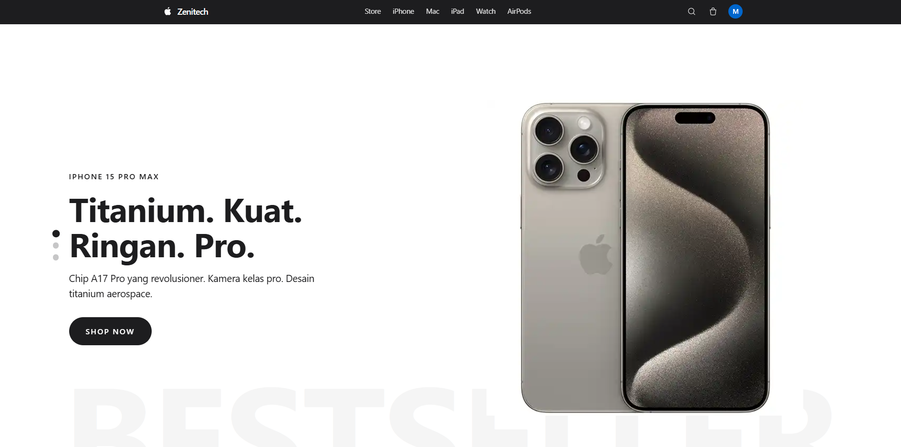
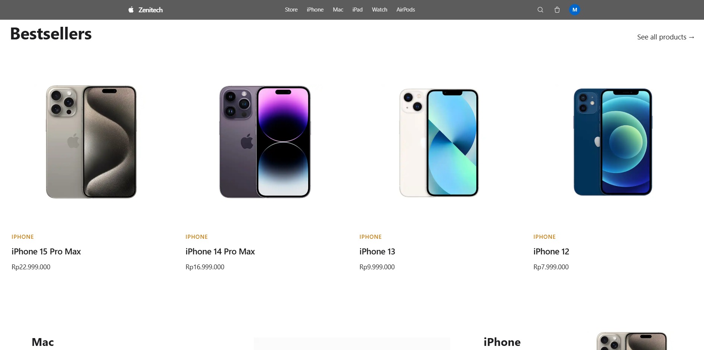
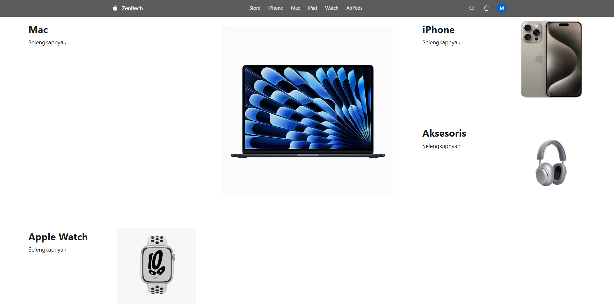
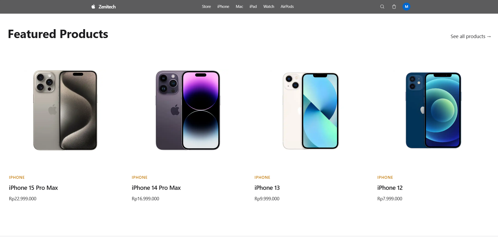
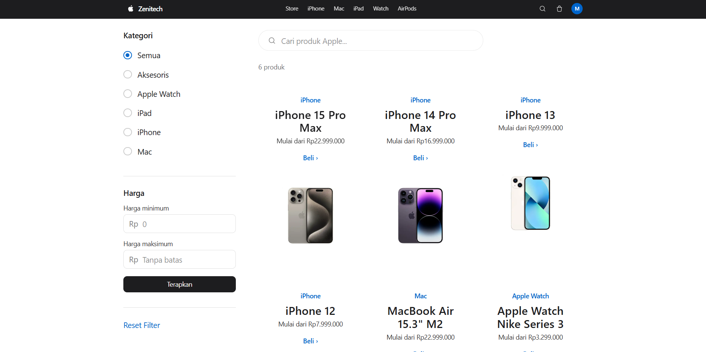
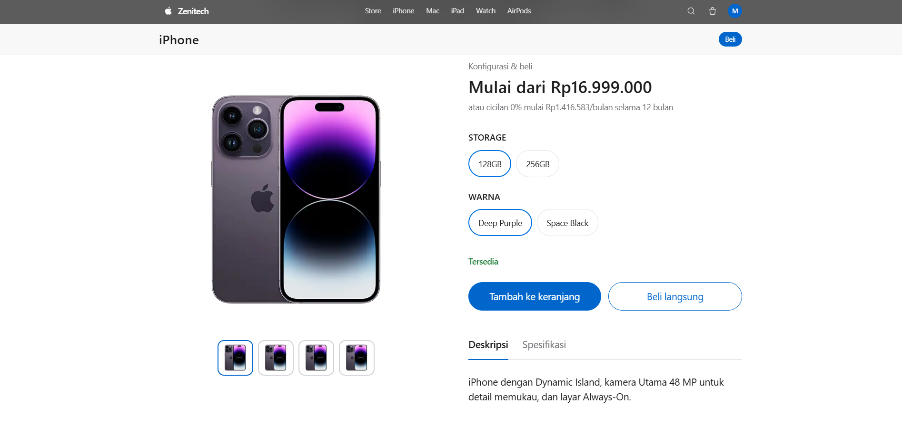
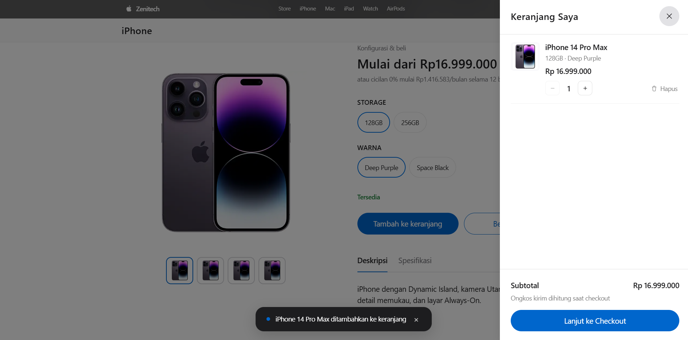
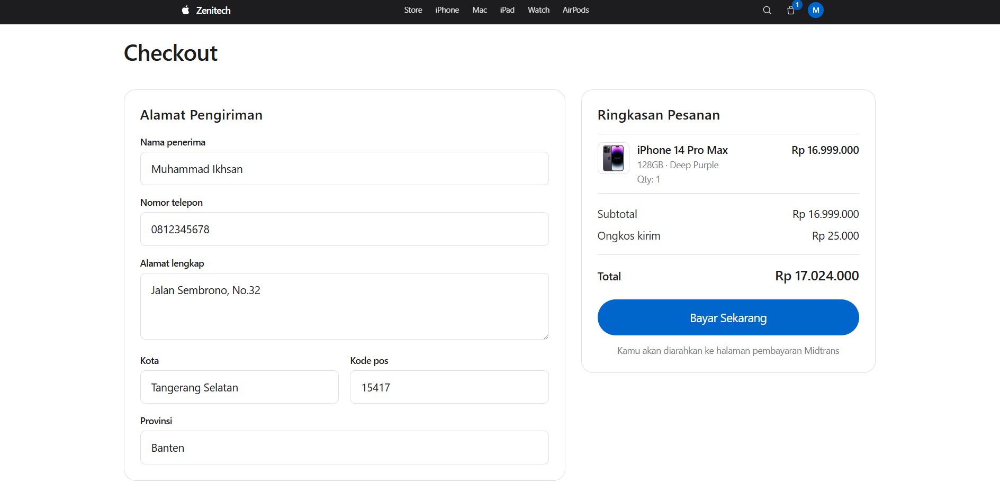
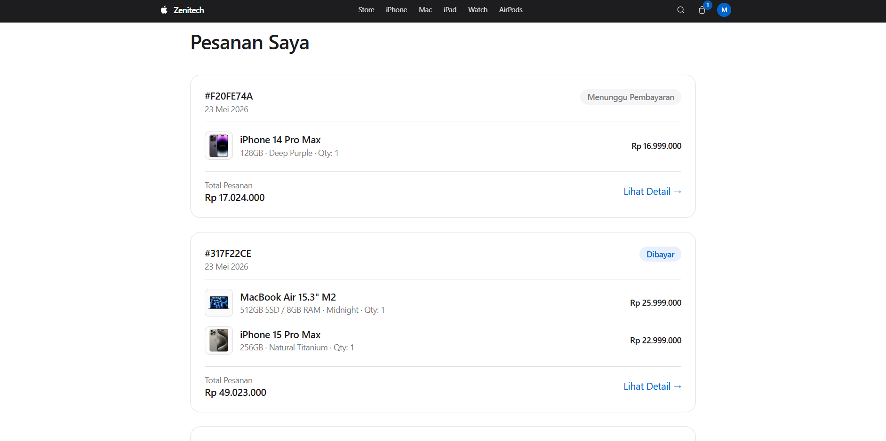

# Zenitech

Apple Authorized Reseller — e-commerce platform untuk pasar Indonesia.

> Belanja resmi iPhone, Mac, iPad, Apple Watch, dan aksesoris Apple. Pembayaran aman via Midtrans, pengiriman ke seluruh Indonesia.

## Tech Stack

- **Frontend**: React 18 + Vite
- **Styling**: Tailwind CSS v4
- **UI Components**: shadcn/ui
- **State Management**: Zustand
- **Animations & Scrolling**: Framer Motion, GSAP, Lenis
- **Backend / Auth / DB / Storage**: Supabase (PostgreSQL + Auth + Storage + Edge Functions)
- **Payment**: Midtrans Snap
- **Routing**: React Router v6
- **Deploy**: Vercel (frontend) + Supabase (backend)

## Demo

Live: _isi setelah deploy_ (mis. https://zenitech.vercel.app)

## Screenshot

Home Page





Products


Product Detail


Cart


Checkout


Orders



## Project Structure

```
zenitech/
├── src/
│   ├── assets/                # Static assets (logo, icons)
│   ├── components/
│   │   ├── ui/                # shadcn components
│   │   ├── store/             # Store (ProductCard, CartDrawer, HeroSlideshow, ...)
│   │   └── admin/             # Admin panel components
│   ├── hooks/                 # Custom React hooks (useProducts, useAuth, ...)
│   ├── lib/
│   │   ├── supabase.js        # Supabase client (single entry point)
│   │   ├── midtrans.js        # Midtrans helper
│   │   ├── orders.js          # Order status helpers
│   │   └── productImages.js   # Product image resolver 
│   ├── pages/
│   │   ├── Home.jsx
│   │   ├── Products.jsx
│   │   ├── ProductDetail.jsx
│   │   ├── Cart.jsx
│   │   ├── Checkout.jsx
│   │   ├── OrderSuccess.jsx
│   │   ├── Orders.jsx
│   │   ├── OrderDetail.jsx
│   │   ├── Login.jsx
│   │   ├── Register.jsx
│   │   └── admin/
│   │       └── Dashboard.jsx
│   ├── store/
│   │   └── cartStore.js       # Zustand cart state
│   ├── router.jsx
│   ├── App.jsx
│   └── main.jsx
├── supabase/
│   ├── migrations/            # SQL migrations (schema, RLS, triggers)
│   ├── functions/             # Edge Functions (create-payment, midtrans-webhook)
│   ├── seed.sql               # Categories, products, variants, images
│   └── storage-policies.sql   # Storage bucket policies
├── public/                    # Static assets disajikan apa adanya
├── .env.example
├── vercel.json                # SPA rewrite untuk React Router di Vercel
├── vite.config.js
├── tailwind.config.js
└── package.json
```

## Setup Lokal

### 1. Clone repository

```bash
git clone https://github.com/he1kousen/zenitech.git
cd zenitech
```

### 2. Install dependencies

```bash
npm install
```

### 3. Setup environment variables

Salin `.env.example` ke `.env`:

```bash
# bash / zsh
cp .env.example .env

# PowerShell
Copy-Item .env.example .env
```

Lalu isi nilai-nilainya. Lihat bagian [Environment Variables](#environment-variables) di bawah.

### 4. Setup Supabase

Project ini butuh Supabase project (gratis di [supabase.com](https://supabase.com)).

#### 4a. Jalankan migration (schema + RLS + trigger)

Buka **Supabase Dashboard → SQL Editor**, lalu jalankan:

1. `supabase/migrations/001_initial_schema.sql` — schema, RLS policies, trigger
2. `supabase/storage-policies.sql` — storage bucket policies (untuk upload gambar produk)

#### 4b. Jalankan seed data

```sql
-- Di SQL Editor, jalankan:
supabase/seed.sql
```

Ini akan mengisi 5 kategori, 9 produk, 60+ variants, dan placeholder images.

#### 4c. Deploy Edge Functions

Pasang [Supabase CLI](https://supabase.com/docs/guides/cli) dulu, lalu:

```bash
# Login ke Supabase
supabase login

# Link ke project Anda
supabase link --project-ref <YOUR_PROJECT_REF>

# Deploy fungsi pembayaran (Midtrans Snap)
supabase functions deploy create-payment

# Deploy webhook handler (Midtrans → Supabase)
supabase functions deploy midtrans-webhook --no-verify-jwt
```

`midtrans-webhook` perlu `--no-verify-jwt` karena dipanggil oleh server Midtrans, bukan oleh user terotentikasi.

#### 4d. Set secrets untuk Edge Functions

```bash
supabase secrets set MIDTRANS_SERVER_KEY=<your-midtrans-server-key>
supabase secrets set MIDTRANS_IS_PRODUCTION=false
```

### 5. Jalankan development server

```bash
npm run dev
```

Buka [http://localhost:5173](http://localhost:5173).

## Environment Variables

Frontend (`.env`):

| Variable | Deskripsi |
|---|---|
| `VITE_SUPABASE_URL` | URL project Supabase Anda (contoh `https://xxx.supabase.co`) |
| `VITE_SUPABASE_ANON_KEY` | Public anon key dari Supabase (aman di-expose ke client) |
| `VITE_MIDTRANS_CLIENT_KEY` | Midtrans Snap client key (sandbox atau production) |

Edge Functions (di-set via `supabase secrets set`):

| Secret | Deskripsi |
|---|---|
| `MIDTRANS_SERVER_KEY` | Midtrans server key — **rahasia**, jangan di-expose ke client |
| `MIDTRANS_IS_PRODUCTION` | `false` untuk sandbox, `true` untuk production |

`SUPABASE_URL` dan `SUPABASE_SERVICE_ROLE_KEY` di-inject otomatis oleh Supabase ke runtime Edge Functions — tidak perlu di-set manual.

## Deploy ke Vercel

1. Push repo ke GitHub.
2. Di [Vercel Dashboard](https://vercel.com), klik **Add New → Project**, import repo.
3. Framework preset: **Vite**.
4. Tambah environment variables (sama seperti `.env`):
   - `VITE_SUPABASE_URL`
   - `VITE_SUPABASE_ANON_KEY`
   - `VITE_MIDTRANS_CLIENT_KEY`
5. Klik **Deploy**.

`vercel.json` sudah berisi rewrite ke `/index.html` agar React Router bekerja pada direct URL (mis. `/products/iphone-16` tidak 404).

## Features

- Katalog produk dengan filter kategori, search, dan pagination
- Product detail dengan gallery, variant selector (storage + warna), dan sticky bar di mobile
- Shopping cart dengan persistent state (Zustand + localStorage)
- Checkout: form alamat, pilih pengiriman, integrasi Midtrans Snap via Edge Function
- Webhook handler dengan verifikasi SHA-512 signature
- Order management buyer: tracking 4-step, history, detail
- Auth: email/password + Google OAuth-ready
- Admin dashboard (CRUD Kategori, Produk, Orders)
- Design system Apple-inspired (single accent #0066cc, SF Pro typography, photography-first)
- Animasi interaktif secara global (*smooth scrolling*, *page transitions*, *staggered reveals*) menggunakan Framer Motion, GSAP, dan Lenis.

## Development Roadmap

| Phase | Status |
|---|---|
| 1 — Foundation (auth, schema, design tokens) | Done |
| 2 — Catalog (home, products, detail, cart) | Done |
| 2.5 — Aesthetic redesign (Apple-style) | Done |
| 3 — Checkout & order management | Done |
| 4 — Admin dashboard & deploy | Done |
| 5 — Global Animations (Framer Motion, GSAP, Lenis) | Done |

## License

Portfolio project — tidak untuk redistribusi komersial. "Apple", logo Apple, "iPhone", "iPad", "Mac", "Apple Watch", dan "AirPods" adalah merek dagang Apple Inc.
